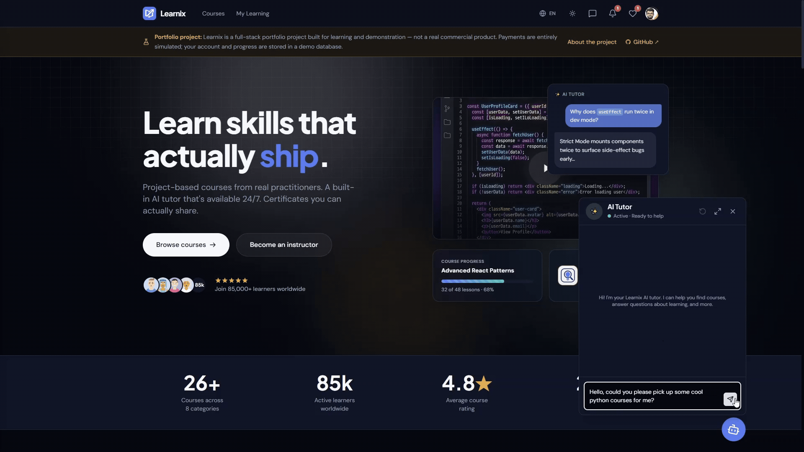
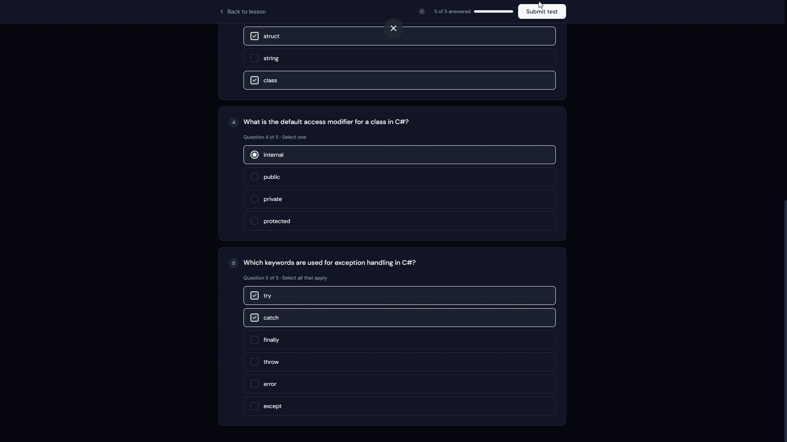

# Learnix

<div align="center">

[](https://github.com/Oleh-Bashtovyi/Learnix/actions/workflows/checks.yml)
[](https://sonarcloud.io/summary/overall?id=Learnix)
[](https://sonarcloud.io/summary/overall?id=Learnix)
[](https://sonarcloud.io/summary/overall?id=Learnix)
[](https://sonarcloud.io/component_measures?id=Learnix&metric=coverage)
[](https://sonarcloud.io/component_measures?id=Learnix&metric=duplicated_lines_density)


[](./LICENSE)

**A production-grade, full-stack Learning Management System (LMS) demonstrating modern architectural patterns and clean code practices.**

🚀 **Live Demo:** <!-- LIVE_DEMO_START -->[https://yellow-rock-00b2edd03.7.azurestaticapps.net](https://yellow-rock-00b2edd03.7.azurestaticapps.net)<!-- LIVE_DEMO_END -->



*Ask the built-in AI tutor for a course — it searches the real catalog and takes you straight to it.*

</div>

## Overview

Learnix is a comprehensive platform where students can browse and purchase courses, instructors can create and manage content, and administrators can moderate the ecosystem. It serves as a technical showcase of building scalable, maintainable monoliths using Clean Architecture and domain-driven principles.

### Video Walkthrough

<!-- WALKTHROUGH_START -->
[](https://www.youtube.com/watch?v=ejVI8B_DYro)
<!-- WALKTHROUGH_END -->

The full student experience — landing, catalog, sign-in, video and text lessons, the AI tutor, tests with saved answers, achievements, instructor messaging and profile.

---

## Tech Stack

### Backend — `Learnix.Backend/`
- **.NET 8** — C# 12, ASP.NET Core 8
- **Clean Architecture + CQRS** via MediatR
- **PostgreSQL** (primary data) + **MongoDB** (chat sessions) + **Redis** (caching)
- **Entity Framework Core** — ORM with Specification Pattern
- **SignalR** — Real-time WebSockets for chat and notifications
- **Transactional Outbox Pattern** — Async messaging via PostgreSQL LISTEN/NOTIFY
- **ASP.NET Identity + JWT** — Auth with refresh token rotation
- **FluentValidation & FluentResults** — Pipeline behavior without exceptions for business logic
- **Serilog + Seq (local) + Azure Application Insights** — Structured JSON logging with CorrelationId tracing
- **AI Integrations** — Google Gemini API
- **Document & Email Generation** — QuestPDF (certificates) and MailKit (SMTP)
- **Azure Blob Storage** — File uploads (videos, images) via Azure SDK

### Frontend — `learnix-client/`
- **React 19 + Vite + TypeScript**
- **TanStack Query** — Server state (caching, mutations, optimistic updates)
- **Zustand** — Client-only state (auth, theme, locale, UI, player, onboarding)
- **React Hook Form + Zod** — Type-safe form validation
- **React Router v7** — Nested layouts, role-based route guards, lazy loading
- **Tailwind CSS + shadcn/ui** — Styling and accessible primitives
- **i18next** — Multi-language localization support
- **Axios** — HTTP client with interceptor-based token refresh

---

## Core Features

- **Authentication & Roles:** JWT-based Auth (Email/Password + Google OAuth). Three distinct roles: Student, Instructor, Admin.
- **Course Ecosystem:** Instructors create/edit courses and modules. Students search, filter, enroll (payments are simulated — no real gateway), track progress, and leave **1-5 star reviews**.
- **Interactive Lessons & Quizzes:** Support for Video (blob streaming), Rich Text (Markdown), and Tests (Multiple choice, Text input with fuzzy match).
- **Real-Time Communication:** 1-on-1 Student ↔ Instructor messaging and global in-app notifications powered by **SignalR**.
- **AI Assistant:** Context-aware chat widget leveraging **Google Gemini** with streaming responses.
- **Achievements & Certificates:** Auto-awarded badges via domain events, and auto-generated PDF certificates (QuestPDF) upon course completion.
- **Admin Panel:** Comprehensive moderation tools (manage users, review instructor applications, oversee mock payments and courses).
- **Localization:** Fully translated UI with language toggles (i18n).

<div align="center">



*Quizzes mix free-text, single- and multi-choice questions. On submit each answer is graded, the correct ones are revealed, and every attempt is stored with a full reviewable history.*

</div>

*Full specification → [`docs/FEATURES.md`](./docs/FEATURES.md)*

---

## System Architecture & Patterns

This project follows a decoupled **Client-Server architecture**.

The **backend** is deliberately built as a **Clean Architecture monolith** utilizing **Feature Folders** for logical grouping. This ensures clean boundaries, making evolution toward a true modular monolith or microservices possible without rewriting the core domain.

The **frontend** is a standalone React Single Page Application (SPA) utilizing a **Feature-Sliced and Layer-Based** structure to maintain high cohesion and predictable scalability as the application grows.

**Backend Architecture:**
- **CQRS via MediatR:** All operations go through dedicated Command/Query handlers; controllers are completely devoid of business logic.
- **Specification Pattern:** Query logic is fully decoupled from repositories, keeping data access clean and testable.
- **Event-Driven Side Effects:** Domain events trigger in-process MediatR integration events. The **Outbox pattern** handles async side effects (sending emails, generating PDFs, checking achievements) reliably.
- **Result Pattern:** `FluentResults` provides explicit error handling. Exceptions are strictly reserved for infrastructure failures, never for control flow.
- **ProblemDetails (RFC 7807):** Standardized, uniform API error responses.
- **API Versioning & Documentation:** URL-segment versioning (`/api/v1/...`) via `Asp.Versioning`, with a fully interactive Swagger UI — one OpenAPI document per version, JWT bearer auth built in, generated from XML doc comments on the controllers.
- **Soft Delete:** A global EF Core query filter (`ISoftDeletable`) backs recoverable deletes across aggregates. Account deletion additionally opens a 30-day recovery window, after which a background worker anonymizes the `User` row instead of hard-deleting it (reviews, messages and payment history reference it and must survive).
- **Rate Limiting:** Per-endpoint policies (`[EnableRateLimiting]`) throttle sensitive routes (auth, uploads, AI chat) against abuse.
- **Opt-In Caching:** Queries implementing `ICacheable<TValue>` are cached transparently by a `CachingBehavior` in the MediatR pipeline — Redis-backed, with no manual cache calls scattered through handlers.
- **Direct-to-Cloud Uploads:** Files never pass through the API server. Clients upload straight to Azure Blob Storage via short-lived SAS tokens into a temp container; on commit the backend validates the file (magic bytes, not just the client-declared `Content-Type`) and copies it into its final container — keeping large video uploads off the API's memory and bandwidth budget.

**Frontend Architecture:**
- **Layer-Based & Feature-Sliced:** Code is organized by domain features within structural layers.
- **Page Co-location:** Page-specific components live strictly alongside their page routes. Reusable UI components are abstracted to `components/common/`.
- **Zod & DTO Separation:** Strict separation between Zod form schemas and typed DTOs. Transformations happen explicitly in `onSubmit` to prevent frontend/backend data shape bleeding.
- **Robust Auth Flow:** Access tokens are kept in memory, while HttpOnly cookies handle refresh tokens. Axios interceptors manage silent token refreshes and queue failed requests during the refresh window.
- **Dual Real-Time Channels:** SignalR (WebSockets) powers notifications and messaging, while the AI tutor's streaming responses run over raw Server-Sent Events — a deliberate split rather than forcing every real-time need through one transport.

**Code Quality & Tooling:**
- **Code Duplication Protection:** The project uses **`jscpd`** to strictly enforce a maximum of **6% code duplication** across the entire repository (both C# and TS/TSX). This is validated globally on every commit via Husky hooks, as well as in GitHub Actions CI pipelines.
- **Strict Formatting:** Managed automatically via `lint-staged` (Prettier for frontend, `dotnet format` for backend).
- **Infrastructure as Code:** Terraform (`infrastructure/`) provisions the Azure Blob Storage containers and lifecycle policies, applied automatically by the `deploy.yml` GitHub Actions workflow on every push to `main`.
- **CI/CD:** GitHub Actions runs build, test, lint, `jscpd` and `gitleaks` secret scanning on every PR (`checks.yml`), then deploys the API to Azure Container Apps and the client to Azure Static Web Apps on merge to `main` (`deploy.yml`).

---

## Testing & Code Coverage

The backend application is thoroughly tested to ensure domain logic integrity and system reliability. Our testing stack includes:

- **xUnit:** The core test framework for executing unit and integration tests.
- **FluentAssertions:** Used for writing highly readable and maintainable assertions.
- **NSubstitute:** A friendly mocking framework used to isolate dependencies and simulate external services.
- **Coverlet:** Cross-platform code coverage library for .NET, integrated into our CI/CD pipeline.

Code quality is continuously analyzed via **SonarCloud** during the CI pipeline — across the whole
repository, backend and frontend alike. Coverage is a backend metric: there are no frontend tests,
so `learnix-client` is excluded from the coverage calculation (but not from the quality analysis).

To run the tests locally and generate a coverage report, execute:
```bash
dotnet test Learnix.Backend.slnx --collect:"XPlat Code Coverage"
```

---

## Repository Structure

```
learnix/
├── Learnix.Backend/
│   ├── Learnix.API              # Controllers, middleware, DI setup
│   ├── Learnix.Application      # CQRS handlers, validators, specifications
│   ├── Learnix.DbMigrator       # Standalone EF Core migrations and data seeding
│   ├── Learnix.Domain           # Entities, domain events, enums, exceptions
│   └── Learnix.Infrastructure   # EF Core, MongoDB, Redis, SignalR, external services
│
├── learnix-client/
│   └── src/                     # React frontend
│
├── infrastructure/              # Terraform (Azure Blob Storage provisioning)
├── docker-compose.yml           # Local infrastructure (postgres, mongo, redis, azurite)
└── docs/                        
    ├── backend/                 # Backend documentation & ADRs
    ├── frontend/                # Frontend documentation & ADRs
    ├── API_KEYS_GUIDE.md        # API configuration guide
    ├── CONTRIBUTING.md          # Commit conventions and contribution guidelines
    └── DEV_SETUP.md             # Local setup checklist
```

---

## Running Locally

Detailed setup instructions, including how to configure external API keys (Google, Gemini), can be found in the documentation:

👉 **[Local Development Setup Guide (`docs/DEV_SETUP.md`)](./docs/DEV_SETUP.md)**

### Option 1: Run everything in Docker (Recommended for quick start)

This approach runs the infrastructure, backend API, and frontend entirely within Docker containers.

> [!IMPORTANT]
> You must copy the `.env.example` files to `.env` in both `Learnix.Backend/Learnix.API` and `learnix-client` BEFORE running these commands. See `docs/DEV_SETUP.md` for details.

```bash
# 1. Start infrastructure (PostgreSQL, MongoDB, Redis, Azurite, Mailpit, Seq)
docker compose up -d

# 2. Initialize database and blob storage (runs the migrator container)
docker compose --profile init up migrator

# 3. Start API and Frontend containers
docker compose --profile apps up -d
```

**Available Endpoints (Docker Setup):**
- **Frontend Client:** [http://localhost:80](http://localhost:80)
- **Backend API:** [http://localhost:8080](http://localhost:8080)
- **Mailpit (Email UI):** [http://localhost:8025](http://localhost:8025)
- **Seq (Logs UI):** [http://localhost:5341](http://localhost:5341)

### Option 2: Run infrastructure in Docker, Apps locally (Recommended for development)

```bash
# 1. Start infrastructure
docker compose up -d

# 2. Initialize database and blob storage
docker compose --profile init up migrator

# 3. Start API locally
cd Learnix.Backend
dotnet run --project Learnix.API

# 4. Start frontend locally
cd ../learnix-client
npm install
npm run dev
```

> **Note:** For a detailed step-by-step guide on how to configure environment variables, API keys, and start the project, see **[`docs/DEV_SETUP.md`](./docs/DEV_SETUP.md)**.

---

## Documentation & Decisions

All architectural choices, trade-offs, and technical debt are documented using Architecture Decision Records (ADRs).

- **[`docs/backend/decisions/README.md`](./docs/backend/decisions/README.md)** — Backend ADRs (Domain modeling, Auth flow, DB choices)
- **[`docs/frontend/decisions/README.md`](./docs/frontend/decisions/README.md)** — Frontend ADRs (State management, UI patterns, i18n)
- **[`docs/TODO.md`](./docs/TODO.md)** — Feature tracking and project roadmap
- **[`docs/CONTRIBUTING.md`](./docs/CONTRIBUTING.md)** — Repository commit conventions

---

## Status

**This project serves as a comprehensive showcase of my full-stack engineering capabilities.** Actively maintained and continuously updated with new features and architectural refinements.

---

## License

Licensed under the [MIT License](./LICENSE).
