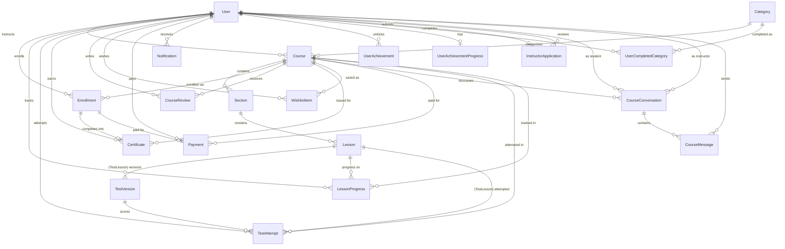
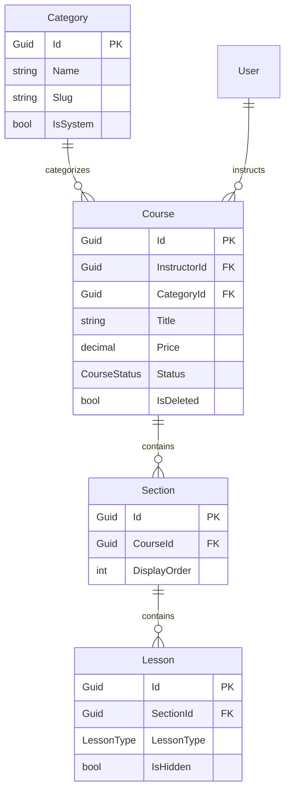
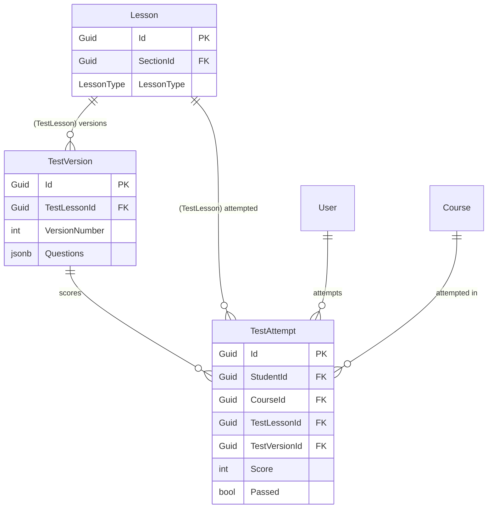
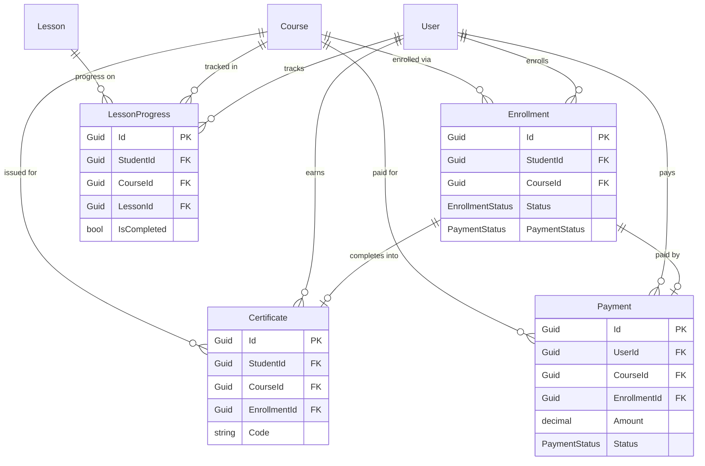
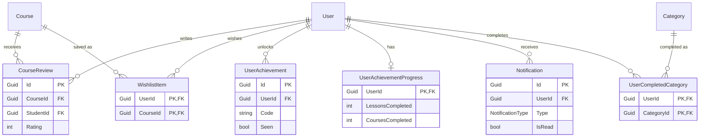
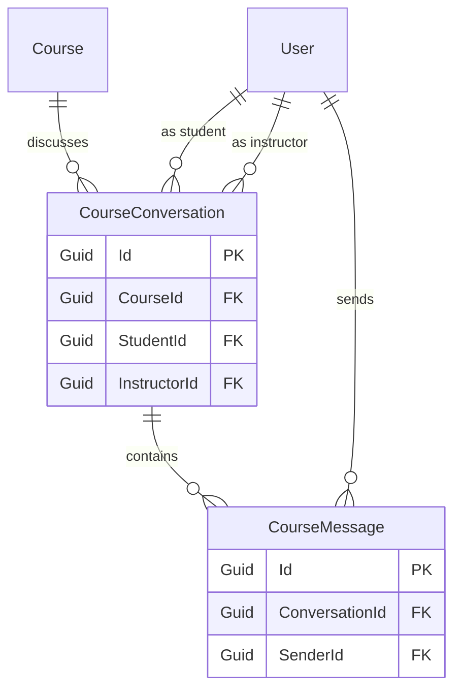
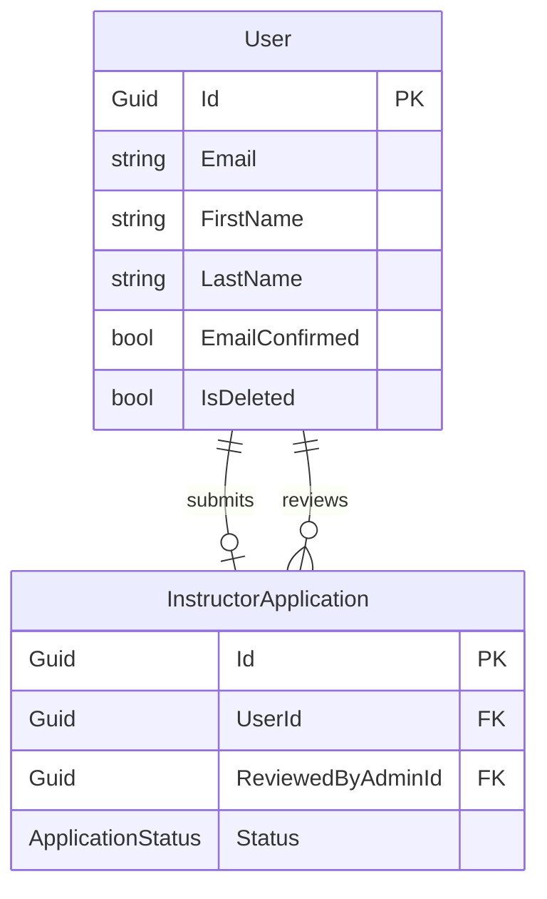

# Learnix — Data Model

> **Note:** This is a living document. Updated to reflect the complete codebase.
> PostgreSQL entities are mapped via EF Core. MongoDB documents via MongoDB.Driver.

---

## Entity-Relationship Diagram

Scoped to the PostgreSQL domain model. `RefreshToken` and `OutboxMessage` are omitted — both are
self-contained infrastructure tables with no relationships to the entities below (see their field
tables further down). `Lesson` is a single table (EF Core TPH): `VideoLesson` / `PostLesson` /
`TestLesson` are the same row with different populated columns depending on `LessonType`, not
separate tables. `TestVersion.Questions` and `TestAttempt.Answers` are JSONB owned collections, not
normalized tables.

A single diagram with all 20 entities and their fields doesn't fit on one screen without zooming, so
this is one relationship-only overview, followed by one diagram per subdomain with fields attached.
`User` and `Course` recur across most of them — shown as bare boxes (no attributes) wherever they're
just the far end of a relationship, with their fields spelled out only in their own home diagram.

### Overview (relationships only)



### Catalog & Curriculum



### Testing & Quizzes



### Learning Progress & Payments



### Engagement



### Messaging



### Identity & Access



---

## PostgreSQL Entities

---

### User
Primary identity entity. Managed by ASP.NET Core Identity (`IdentityUser<Guid>` base).
Implements `IAuditable`, `IHasDomainEvents` directly.

| Field | Type | Notes |
|---|---|---|
| `Id` | `Guid` | PK (from `IdentityUser<Guid>`) |
| `Email` | `string` | Unique, required |
| `NormalizedEmail` | `string` | Identity-managed |
| `UserName` | `string` | Mirrors Email |
| `PasswordHash` | `string?` | Null for Google-only accounts |
| `EmailConfirmed` | `bool` | Default: false |
| `FirstName` | `string` | Required, max 100 |
| `LastName` | `string` | Required, max 100 |
| `AvatarBlobPath` | `string?` | Azure Blob path (not a full URL) |
| `Bio` | `string?` | Max 500 chars |
| `GoogleId` | `string?` | For Google OAuth accounts |
| `Language` | `string` | UI locale, default `"en"` |
| `IsDeleted` | `bool` | Soft delete |
| `DeletedAt` | `DateTime?` | UTC |
| `PurgeAfter` | `DateTime?` | `DeletedAt` + 30-day recovery window; anonymized by a background worker once passed |
| `CreatedAt` | `DateTime` | UTC, set by `AuditableInterceptor` |
| `UpdatedAt` | `DateTime` | UTC, set by `AuditableInterceptor` |

**Relations:**
- Has many `Enrollment`
- Has many `LessonProgress`
- Has many `TestAttempt`
- Has many `Certificate`
- Has many `CourseReview`
- Has many `Course` (as instructor)
- Has many `RefreshToken`
- Has many `Payment`
- Has many `Notification`
- Has many `UserAchievement`
- Has many `WishlistItem`
- Has one `InstructorApplication`
- Has one `UserAchievementProgress`

---

### RefreshToken
Stored hashed refresh tokens for JWT rotation.

| Field | Type | Notes |
|---|---|---|
| `Id` | `Guid` | PK |
| `UserId` | `Guid` | FK → User |
| `TokenHash` | `string` | SHA-256 hash |
| `ExpiresAt` | `DateTime` | UTC |
| `IsRevoked` | `bool` | Default: false |
| `RevokedAt` | `DateTime?` | UTC |
| `CreatedAt` | `DateTime` | UTC |
| `UpdatedAt` | `DateTime` | UTC |

---

### OutboxMessage
Reliable blob-storage and event operation queue. Processed by a background worker.

| Field | Type | Notes |
|---|---|---|
| `Id` | `Guid` | PK |
| `Type` | `string` | Message type (e.g., DeleteBlob, DomainEvent) |
| `Payload` | `string` | JSON payload |
| `OccurredAt` | `DateTime` | UTC |
| `ProcessedAt` | `DateTime?` | UTC |
| `AttemptCount` | `int` | |
| `LastAttemptAt` | `DateTime?` | UTC |
| `LastError` | `string?` | |
| `NextRetryAt` | `DateTime?` | UTC |

---

### InstructorApplication
Student submits to become an Instructor. Admin reviews.

| Field | Type | Notes |
|---|---|---|
| `Id` | `Guid` | PK |
| `UserId` | `Guid` | FK → User, Unique |
| `MotivationText` | `string` | |
| `PortfolioUrl` | `string?` | |
| `Status` | `ApplicationStatus` | Pending / Approved / Rejected |
| `RejectionReason` | `string?` | |
| `ReviewedByAdminId` | `Guid?` | FK → User |
| `CreatedAt` | `DateTime` | UTC |
| `ReviewedAt` | `DateTime?` | UTC |

---

### Category

| Field | Type | Notes |
|---|---|---|
| `Id` | `Guid` | PK |
| `Name` | `string` | Unique |
| `Slug` | `string` | URL-friendly |
| `IsSystem` | `bool` | Protected from deletion |
| `ImageBlobPath` | `string?` | Azure Blob path |
| `CoursesCount` | `int` | Denormalized |
| `CreatedAt` | `DateTime` | UTC |
| `UpdatedAt` | `DateTime` | UTC |

---

### UserCompletedCategory
Tracks which course categories a user has completed.

| Field | Type | Notes |
|---|---|---|
| `UserId` | `Guid` | FK → User, PK composite |
| `CategoryId` | `Guid` | FK → Category, PK composite |

---

### Course

| Field | Type | Notes |
|---|---|---|
| `Id` | `Guid` | PK |
| `InstructorId` | `Guid` | FK → User |
| `CategoryId` | `Guid` | FK → Category |
| `Title` | `string` | |
| `Description` | `string` | Markdown |
| `CoverBlobPath` | `string?` | |
| `Price` | `decimal` | 0 = free |
| `Status` | `CourseStatus` | Draft / Published / Archived |
| `EnrollmentsCount` | `int` | Denormalized |
| `AverageRating` | `decimal` | Denormalized |
| `ReviewsCount` | `int` | Denormalized |
| `Tags` | `string[]` | PostgreSQL array |
| `IsDeleted` | `bool` | Soft delete |
| `DeletedAt` | `DateTime?` | UTC |
| `CreatedAt` | `DateTime` | UTC |
| `UpdatedAt` | `DateTime` | UTC |

---

### Section

| Field | Type | Notes |
|---|---|---|
| `Id` | `Guid` | PK |
| `CourseId` | `Guid` | FK → Course |
| `Title` | `string` | |
| `DisplayOrder` | `int` | |
| `CreatedAt` | `DateTime` | UTC |
| `UpdatedAt` | `DateTime` | UTC |

---

### Lesson (TPH)

| Field | Type | Notes |
|---|---|---|
| `Id` | `Guid` | PK |
| `SectionId` | `Guid` | FK → Section |
| `Title` | `string` | |
| `DisplayOrder` | `int` | |
| `IsHidden` | `bool` | |
| `LessonType` | `LessonType` | Video / Post / Test |
| `CreatedAt` | `DateTime` | UTC |
| `UpdatedAt` | `DateTime` | UTC |

#### VideoLesson
| Field | Type | Notes |
|---|---|---|
| `VideoBlobPath` | `string` | |
| `Description` | `string?` | |
| `DurationSeconds` | `int?` | |

#### PostLesson
| Field | Type | Notes |
|---|---|---|
| `Content` | `string` | Markdown |

#### TestLesson
| Field | Type | Notes |
|---|---|---|
| `Description` | `string?` | |
| `AttemptLimit` | `int?` | |
| `CooldownMinutes` | `int?` | |
| `PassingThreshold` | `int` | |
| `ReviewMode` | `TestReviewMode` | How much of an attempt the student sees back |
| `CurrentVersionId` | `Guid?` | The `TestVersion` a new attempt is served |
| `QuestionsCount` | `int` | Denormalised count of the current version's questions |

The questions are **not** here — see `TestVersion`.

---

### TestVersion

One edition of a test's questions. A `StudentAnswer` names its question and its options by position, so
an attempt is only legible against the exact list it was served; the lesson therefore points at a version
rather than holding the questions itself (ADR-BACK-LMS-006).

An edit reuses the current version's row while nothing has been attempted against it, and inserts a new
one the moment something has — so a test nobody has taken keeps exactly one row however often it is edited.

| Field | Type | Notes |
|---|---|---|
| `Id` | `Guid` | PK |
| `TestLessonId` | `Guid` | FK → Lesson, cascade |
| `VersionNumber` | `int` | Unique per lesson |
| `Questions` | JSONB | Owned collection |

---

### Question, QuestionOption, TextAnswerConfig
**Owned types** stored as JSONB inside `TestVersion`.

---

### TestAttempt

| Field | Type | Notes |
|---|---|---|
| `Id` | `Guid` | PK |
| `StudentId` | `Guid` | FK → User |
| `CourseId` | `Guid` | FK → Course |
| `TestLessonId` | `Guid` | FK → Lesson |
| `TestVersionId` | `Guid` | FK → TestVersion, pinned at start — what the attempt is scored and replayed against |
| `AttemptNumber` | `int` | |
| `StartedAt` | `DateTime` | UTC |
| `SubmittedAt` | `DateTime?` | UTC |
| `Score` | `int?` | Percentage |
| `MaxScore` | `int?` | |
| `Passed` | `bool?` | |
| `Answers` | JSONB | Owned value objects |

---

### Enrollment

| Field | Type | Notes |
|---|---|---|
| `Id` | `Guid` | PK |
| `StudentId` | `Guid` | FK → User |
| `CourseId` | `Guid` | FK → Course |
| `Status` | `EnrollmentStatus` | Active / Completed |
| `PaymentStatus` | `PaymentStatus` | Pending / Completed / Failed |
| `PricePaid` | `decimal` | |
| `EnrolledAt` | `DateTime` | UTC |
| `CompletedAt` | `DateTime?` | UTC |
| `CreatedAt` | `DateTime` | UTC |
| `UpdatedAt` | `DateTime` | UTC |

---

### LessonProgress

| Field | Type | Notes |
|---|---|---|
| `Id` | `Guid` | PK |
| `StudentId` | `Guid` | FK → User |
| `CourseId` | `Guid` | FK → Course |
| `LessonId` | `Guid` | FK → Lesson |
| `IsCompleted` | `bool` | |
| `LastAccessedAt` | `DateTime` | UTC |
| `CompletedAt` | `DateTime?` | UTC |

---

### Certificate

| Field | Type | Notes |
|---|---|---|
| `Id` | `Guid` | PK |
| `StudentId` | `Guid` | FK → User |
| `CourseId` | `Guid` | FK → Course |
| `EnrollmentId` | `Guid` | FK → Enrollment |
| `Code` | `string` | Unique, e.g. `CERT-20260802-A1B2C3D4` |
| `FilePath` | `string?` | Azure Blob path (not a full URL) |
| `IssuedAt` | `DateTime` | UTC |

---

### CourseReview

| Field | Type | Notes |
|---|---|---|
| `Id` | `Guid` | PK |
| `CourseId` | `Guid` | FK → Course |
| `StudentId` | `Guid` | FK → User |
| `Rating` | `int` | 1–5 |
| `Comment` | `string?` | |
| `CompletedLessonsAtReview` | `int` | Snapshot of progress when the review was (last) written |
| `TotalLessonsAtReview` | `int` | Snapshot of the course's lesson count at that time |

---

### CourseConversation & CourseMessage
Chat between Student and Instructor.

#### CourseConversation
| Field | Type | Notes |
|---|---|---|
| `Id` | `Guid` | PK |
| `CourseId` | `Guid` | FK → Course |
| `StudentId` | `Guid` | FK → User |
| `InstructorId` | `Guid` | FK → User |
| `StudentUnreadCount` | `int` | |
| `InstructorUnreadCount`| `int` | |
| `LastMessagePreview` | `string?` | Truncated copy of the latest message |
| `LastMessageAt` | `DateTime?` | UTC |

#### CourseMessage
| Field | Type | Notes |
|---|---|---|
| `Id` | `Guid` | PK |
| `ConversationId` | `Guid` | FK → CourseConversation |
| `SenderId` | `Guid` | FK → User |
| `Content` | `string` | |

---

### WishlistItem
| Field | Type | Notes |
|---|---|---|
| `UserId` | `Guid` | FK → User |
| `CourseId` | `Guid` | FK → Course |
| `CreatedAt` | `DateTime` | UTC |
| `UpdatedAt` | `DateTime` | UTC |

---

### UserAchievement & UserAchievementProgress

#### UserAchievement
Records earned achievements. There is no `Achievement` table — achievements are a static catalog
(`AchievementCodes` constants), and `Code` is just that catalog's identifier, not a foreign key.

| Field | Type | Notes |
|---|---|---|
| `Id` | `Guid` | PK |
| `UserId` | `Guid` | FK → User |
| `Code` | `string` | Achievement catalog identifier, e.g. `"first-course-completed"` |
| `UnlockedAt` | `DateTime` | UTC |
| `Seen` | `bool` | Whether the unlock toast/badge has been acknowledged |

#### UserAchievementProgress
Denormalized cache of per-user counters for the achievements page.

| Field | Type | Notes |
|---|---|---|
| `UserId` | `Guid` | FK → User, PK |
| `LessonsCompleted` | `int` | |
| `CoursesCompleted` | `int` | |
| `DistinctCategoriesCompleted`| `int` | |
| `ProfileCompleted` | `bool` | |

---

### Payment

| Field | Type | Notes |
|---|---|---|
| `Id` | `Guid` | PK |
| `UserId` | `Guid` | FK → User |
| `CourseId` | `Guid` | FK → Course |
| `Amount` | `decimal` | |
| `Currency` | `string` | |
| `PaymentProvider` | `string` | `"Mock"` — no real gateway is integrated |
| `Status` | `PaymentStatus` | Pending / Completed / Failed |
| `CompletedAt` | `DateTime?` | UTC |

---

### Notification

The server never composes the notification's text — it stores *what happened*, and the client renders
the sentence from `Type` + `Parameters`. There is no `Title`/`Body`/`RelatedEntityId`; `Parameters` is
the one flexible field that carries whatever the client needs to name the thing (a course title, an
achievement code).

| Field | Type | Notes |
|---|---|---|
| `Id` | `Guid` | PK |
| `UserId` | `Guid` | FK → User |
| `Type` | `NotificationType`| e.g. `RoleAssigned`, `AchievementUnlocked`, `NewMessage` |
| `Parameters` | `string?` | Flat JSON object of strings, or `null` when `Type` alone says everything |
| `IsRead` | `bool` | |

---

## MongoDB Documents

### ChatSession
AI assistant conversation history per user.

```json
{
  "_id": "ObjectId",
  "userId": "Guid (string)",
  "isActive": "bool",
  "createdAt": "DateTime",
  "updatedAt": "DateTime",
  "closedAt": "DateTime?",
  "messages": [
    {
      "role": "user | assistant | tool_result",
      "content": "string",
      "toolCalls": [
        {
          "callId": "string",
          "toolName": "string",
          "argumentsJson": "string",
          "resultJson": "string?"
        }
      ],
      "sentAt": "DateTime"
    }
  ]
}
```

---

## Key Relations Summary

See the [Entity-Relationship Diagram](#entity-relationship-diagram) at the top of this document for
the full relationship graph. Two relations live only inside JSONB columns, not as rows of their own:

```
TestVersion.Questions   ──< Question (JSONB) ──< QuestionOption (nested)
TestAttempt.Answers     ──< StudentAnswer (JSONB)
```
